# Born2beroot

so firstly congratulations for passing C and now being in the system and network administration branch.

the first project it has is **Born2beroot**.

## what are you required to do

you're supposed to create your first server with specific rules that you choose. so the first thing you do is the installation guide.

but first, theory:

## theory: virtual machines

a VM is a "simulated" computer running inside your real computer (the host). it's created by software called a hypervisor, which splits the physical resources (CPU, RAM, disk) of the real machine and allocates them to one or more virtual machines, each acting like an independent computer with its own OS.

### why they're used

1. test software/OS without risking your main machine
2. run multiple OSes at once (e.g. Linux + Windows on the same PC)
3. isolation/security — if a VM crashes or gets infected, the host stays safe

## what we need

we need to download the iso of the virtual machine. the subject tells us to either choose Debian or Rocky (stable versions, meaning we have to be careful not to download unstable ones).

i chose Debian since it's more beginner friendly.

### what is an iso?

an ISO file is like a "photograph" of an entire disc — every file, every folder, exactly as it would be arranged on the physical disc — except it's not a physical disc at all. it's just one single file on your computer, usually a few hundred MB to a few GB in size, ending in `.iso`.

**what can you do with it?**

1. install an OS
2. distribute software
3. mount it as a virtual disc

> don't forget to check the disk usage — the Debian 13 iso i'm currently downloading is about 755 MB.

go to https://www.debian.org/

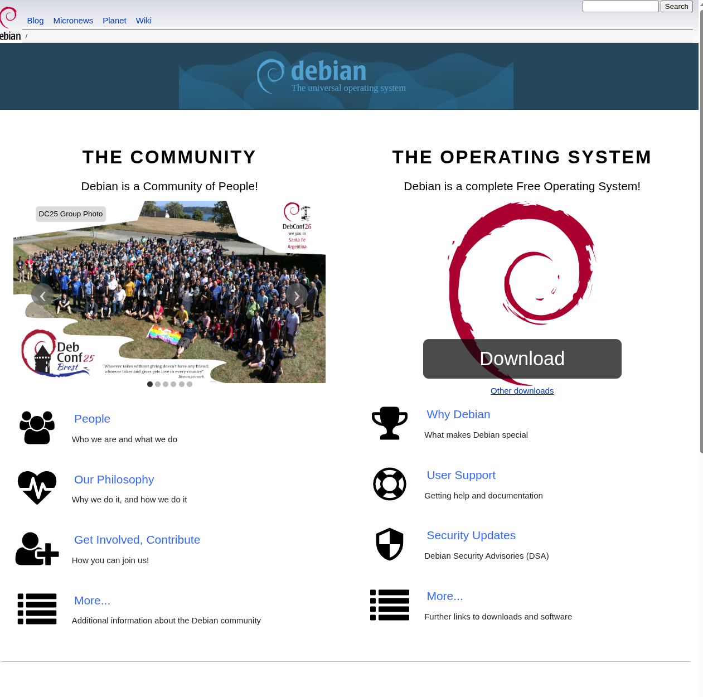

click download in the black square. keep in mind they never promote unstable versions of Debian on their home page, so it's okay to just click download.

then in your download directory you'll find the iso.

## setting up the VM in VirtualBox

open Oracle VirtualBox on your computer.

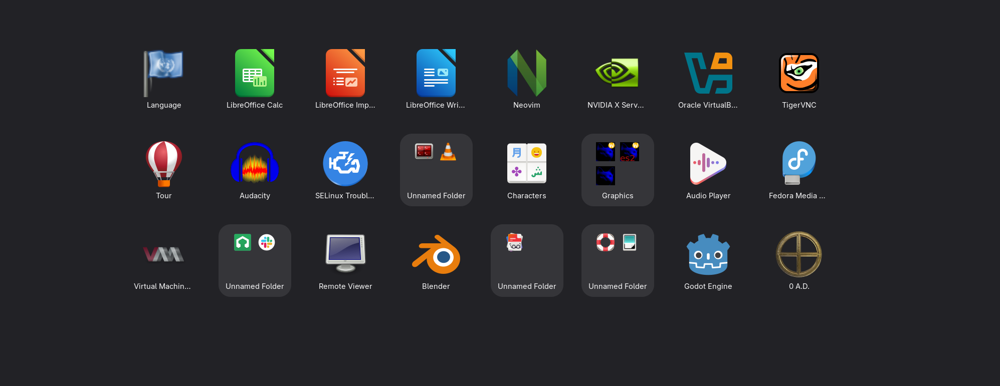

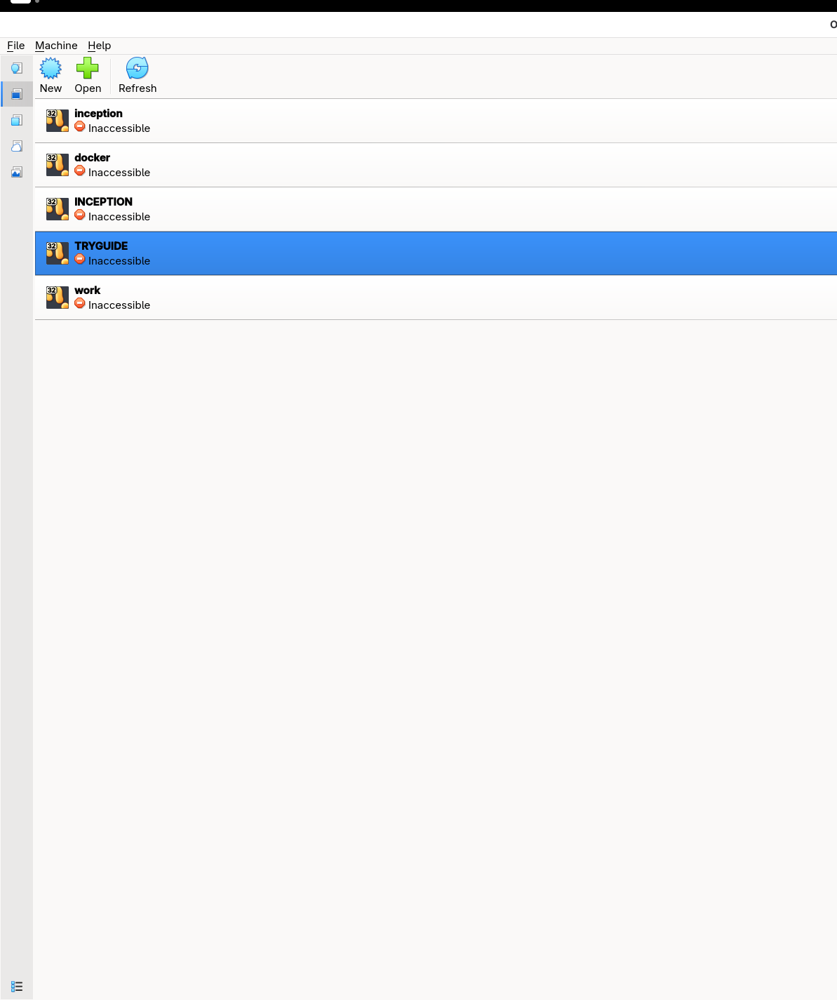

click the blue "flower" icon that says **New** at the top.

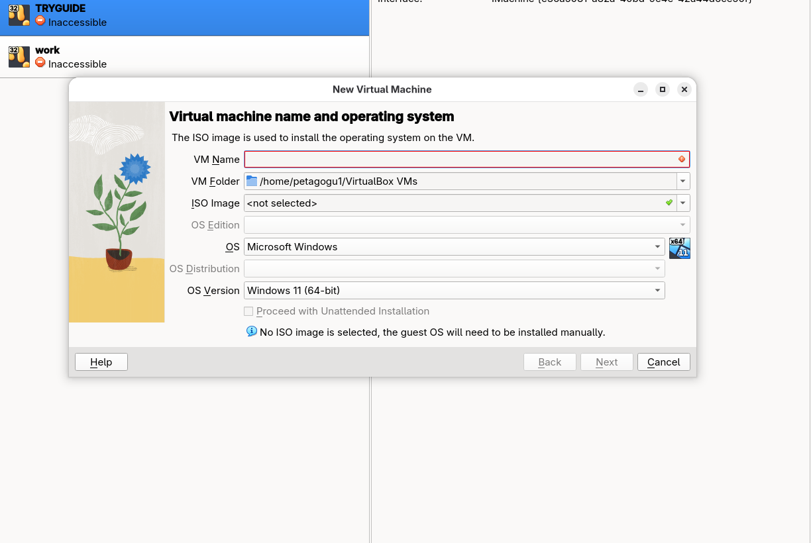

this will pop up. at VM name, call it whatever — i'm calling mine `b2br`. at VM folder, you'll have to fix the path.

**for this project use `goinfre`**, because creating this VM requires a lot of GB which your home directory doesn't have.

so remove `home` and put `goinfre` there instead, also remove `VirtualBox VMs` from the path.

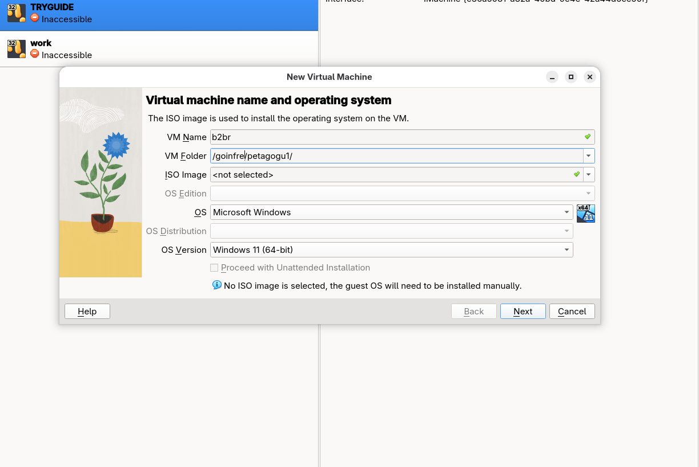

this is how it should look.

then click the iso image arrow and choose the iso from your download directory.

after that click **proceed with unattended installation**.

click next.

then this will show up — just click yes, everything is enough.

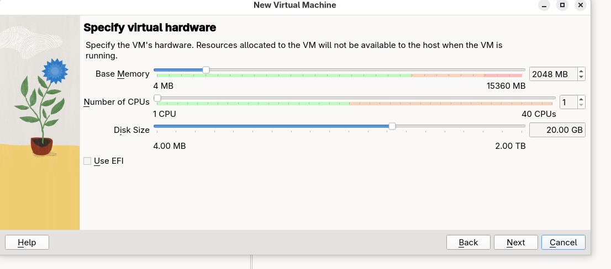

next again.

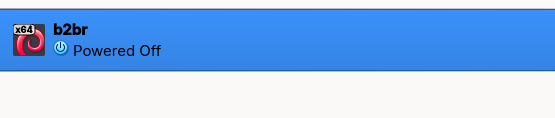

this will show up, just click `b2br`.

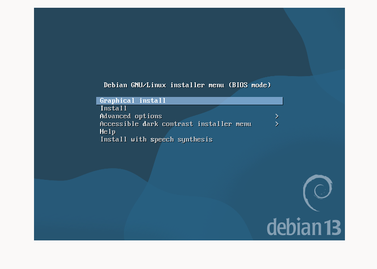

this will show up, just click install.

## installation walkthrough

choose your language.

then set your location — if you can't find it, click "other," choose the continent/region you're in, and select your country from the list.

also select the locale settings (i usually choose US) and choose the keymap: American English.

you'll go through some installation steps:

- **hostname**: `yourlogin42`
- **domain name**: just click continue

### root password

rules:
1. at least 10 characters
2. uppercase + lowercase + number required
3. no more than 3 identical characters in a row
4. can't contain the username (for root, that means the password can't contain "root")

### user setup

it'll ask for the full name of the user — put your 42 username there. then it'll ask for the username of your account, and you'll see the name you entered before — just continue.

then it wants the password for the new user, same rules apply:

1. at least 10 characters
2. uppercase + lowercase + number required
3. no more than 3 identical characters in a row
4. can't contain the username (for user, that means the password can't contain your username, or at least 7 characters of it)

re-enter the password.

### partitioning

now you'll see the partitioning method — choose the third option.

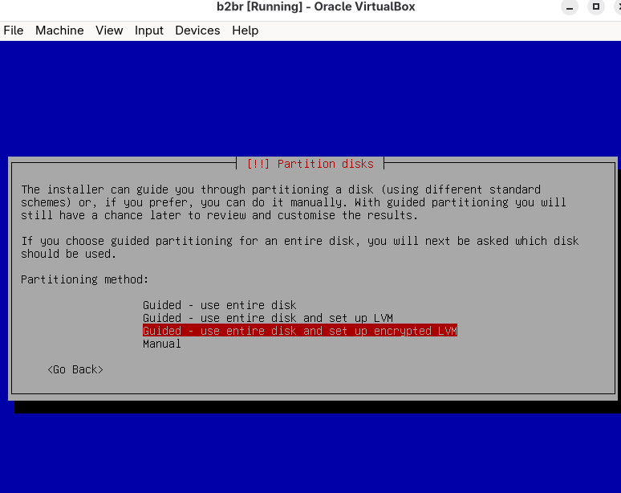

continue, and when it says "select disk to partition," just press enter.

**partitioning scheme:**

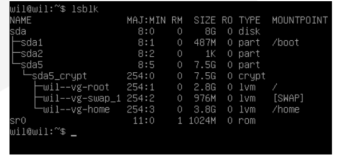

the pdf wants it like this, so what you choose is a separate `/home` partition. then it'll ask to write changes to the disk — say yes.

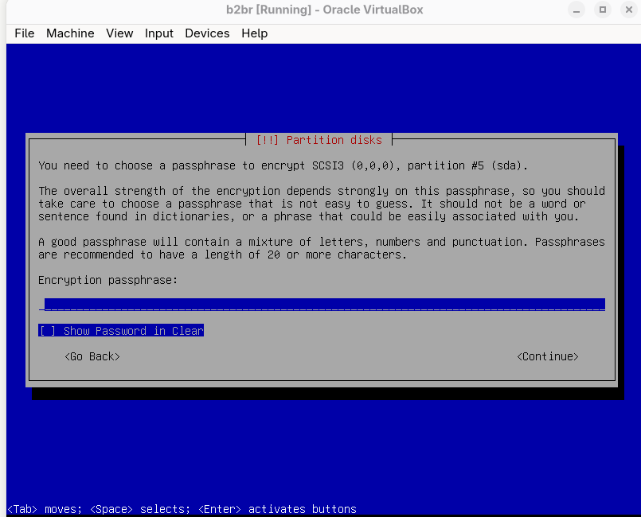

this will show up, then you need to enter a passphrase — the VM won't boot otherwise, so remember the passphrase.

it'll then ask about the amount for the volume group — for guided partitioning, just continue.

click **finish partitioning**, then:

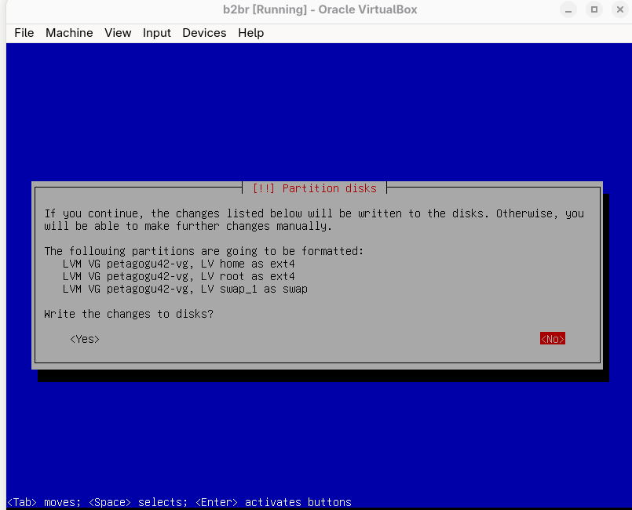

this shows up, just click yes.

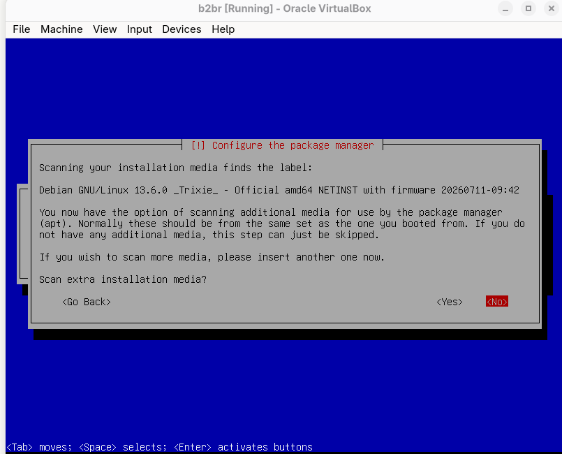

click no.

then you'll be asked to choose a mirror country.

**what is this?**

a mirror is just a download server for packages — pick your country or a nearby country for faster speeds. it doesn't affect the project at all.

select it, click continue, then continue again.

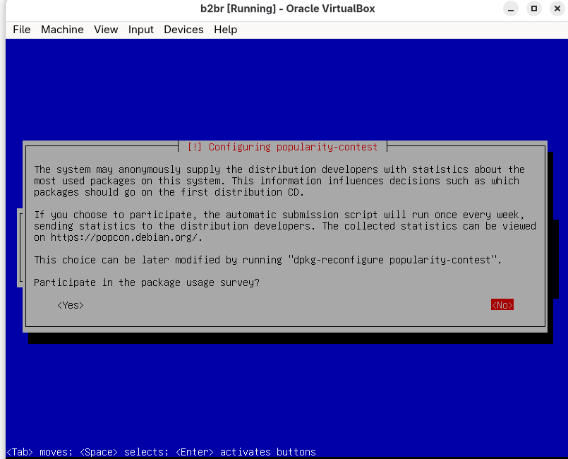

this will show up, still harmless to the project, so do whatever.

then this will show up — you only need **SSH server** and **standard system utilities** selected.

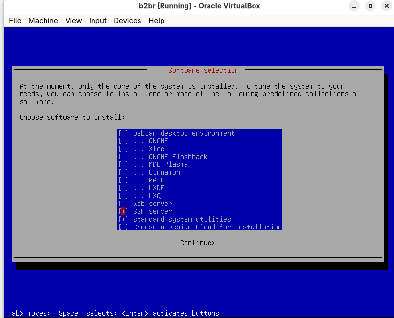

if you have others selected, deselect them.

### GRUB boot loader

GRUB is the bootloader that starts Debian when the VM powers on.

select yes to install GRUB.

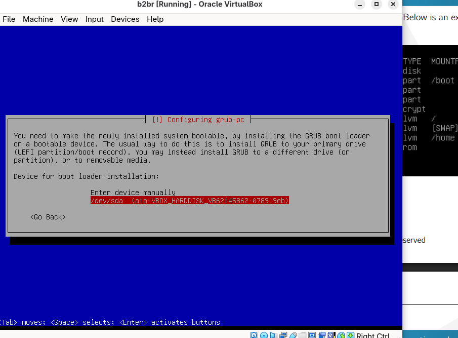

then choose `/dev/sda`.

the installation is complete. click continue and your Debian VM is ready.